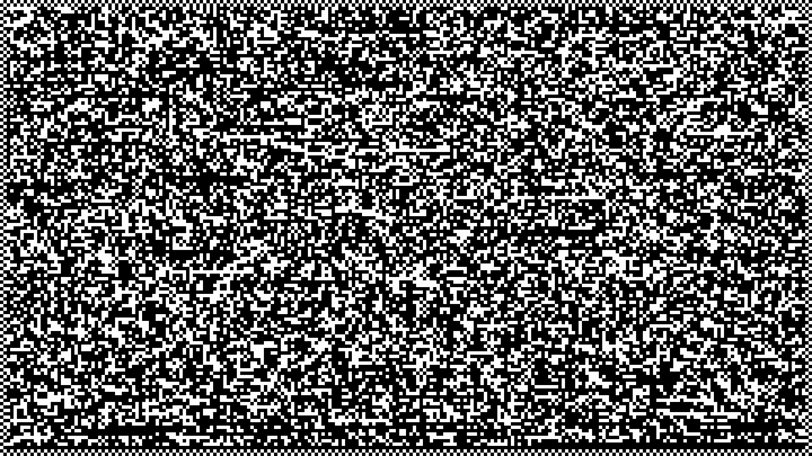

# dmvpack

**Data Matrix Video Packer** — an archiver that packs files into black-and-white video.

**Version 1.2.0** · Copyright 2026 Vladimir Sirenko \<vmsirenko@gmail.com\>

An archiver that packs files and directories into black-and-white video (exactly **1 bit per
cell**) and extracts them back. The frame format is based on **Data Matrix** barcode technology.
The recorded mp4 can be uploaded to a video hosting: after re-encoding (x264 transcode,
resolution change, audio recompression) the data is recovered — the manifest lives in the audio
track, and the frames are protected by two levels of error correction.

Pure Rust (no native dependencies) + external `ffmpeg`/`ffprobe` in PATH.

An example of a packed file frame (snapshot, 1920×1080):



## Based on Data Matrix

Each frame is essentially one **Data Matrix** symbol, adapted for video:

- a black-and-white module grid (**1 bit/cell**) with a **perimeter border** — like the
  L-shaped finder pattern and "clock track" of Data Matrix: a reader locates the grid even
  after scaling and offsets;
- **inner RS(255,239) over GF(256)** — the same Reed–Solomon algebra as in the Data Matrix
  **ECC200** standard (~8 % redundancy per frame);
- the frame sequence and splitting into parts follow the **Structured Append** idea of Data
  Matrix — numbered symbols of a single message.

Differences from "pure" Data Matrix are dictated by the channel:

- the stream is compressed (`tar` + `zstd`) before encoding — Data Matrix has no compression;
- an **outer RS level** (4+1) is added between frames — whole lost or corrupted "symbols"
  are recovered;
- the manifest is transmitted as **FSK audio** on a separate track;
- the system is built to survive **lossy video re-encoding** (x264, resolution downscale,
  AAC recompression) — a channel that Data Matrix does not have;
- no masking and no serpentine placement: data goes row by row, alignment comes from the
  frame border, not from module masking.

## How it works

**1. Compression.** Directory/file → `tar` + `zstd` → a continuous byte stream.

**2. Video (data layer).** The stream is cut into payloads and drawn as frames:

- default grid **240×135 cells**, cell size 8 px, border 2 px → 1920×1080 resolution;
- every cell is strictly black or white (1 bit); by default that is **3864 bytes per frame**;
- the reading decoder locates the start of a frame from the border and grid offsets even
  after scaling.

**3. Outer ECC (between frames).** Frames are grouped (default **4+1**:4 data frames
+1 Reed–Solomon parity frame) — fully lost or corrupted frames are recovered.

**4. Inner ECC (inside a frame).** Before writing, each frame goes through **RS(255,239)**
over GF(256) (syndromes → Berlekamp–Massey → Chien → interpolation, with result verification).
The frame payload is zero-padded to `239×n`; the ~8 % redundancy cleans up "noisy" cells
after re-encoding.

**5. Audio (manifest).** File names, sizes, sha256 and crc32 checksums, video parameters —
modulated with **FSK:1200 baud**, tones1200/2400 Hz, mono48 kHz, amplitude0.65,
50 ms pause between copies, a256-bit preamble `sha256("vidarc-preamble-v1")` (a historical
format constant). Manifest copies are **up to16, at least2** — guaranteed even for a
tiny archive (audio is never shorter than video). The demodulator first hard-finds all
preamble occurrences, then softly combines copies bit by bit (by energy sum), so
re-encoded audio down to AAC ~48 kbps is read losslessly.

**Why the manifest lives in the audio.** The manifest is needed *before* the payload can be
assembled, and the video layer is the one that suffers from re-encoding — keeping the manifest
in the cell grid would make it compete for bandwidth and let it die together with the data.
Audio is an **independent channel**: video downscaling/cropping and audio resampling/re-encoding
degrade separately, so combining copies recovers the manifest even at AAC ~48 kbps. A separate
track is cheap (mono 48 kHz), allows up to16 copies, and its duration is deliberately ≥ the video.

**6. mp4 assembly.** `ffmpeg`: video stream — `libx264` (default `--crf16 --preset medium`),
audio — `aac --b:a 96k`. The audio is intentionally longer than the video — the track is
not trimmed.

## Robustness (tested)

The same archive (448 frames ≈15 s) was pushed through re-encoding and extracted back —
`cmp` confirms **byte-identical** output:

| Re-encoding | Result |
|---|---|
| 1080p crf16, aac96k |448/448 frames, identical |
| 720p crf26 /480p crf26, aac64k | identical (outer RS absorbs frame degradation) |
| 480p crf32, aac48k | identical (manifest recovered by combining copies) |
| 360p crf30, aac48k | identical |
| **VK Video (real hosting)**:1080p→720p, mono AAC97k→stereo AAC261k | identical, sha256 matched |
| 480p crf36, **aac32k** | fails — the scheme's limit (correlated errors in both copies) |

Practical threshold: **video survives very heavy re-encoding** (360p/crf30),
**audio needs ≥48 kbps**.

## Usage

```bash
# pack a directory (or file) into a video
dmvpack pack mydata/ -o mydata.mp4

# unpack it back
dmvpack unpack mydata.mp4 -o restored/

# split into500 MB parts (each part is a standalone video)
dmvpack pack mydata/ -o mydata.mp4 --max-part-size 500M
# → mydata.part1.mp4, mydata.part2.mp4, ...
dmvpack unpack mydata.part1.mp4 mydata.part2.mp4 mydata.part3.mp4 -o restored/

# pack with a password (archive encryption)
dmvpack pack mydata/ -o mydata.mp4 -p "correct horse battery staple"
dmvpack unpack mydata.mp4 -o restored/ -p "correct horse battery staple"
```

`pack` options (grouped in `--help` into `Options` — simple, and `Advanced` —
fine tuning; environment variables are listed there as well):

| Option | Default | Purpose |
|---|---|---|
| `-o, --output` | `<input>.mp4` | output file |
| `--cell` |8 | cell size in pixels (≥4) |
| `--cols`, `--rows` | 240, 135 | grid (240×135 =1080p at cell8) |
| `--fps` | 30 | frames per second |
| `--crf` | 16 | x264 quality (lower = better) |
| `--preset` | medium | x264 preset |
| `--group`, `--parity` |4,1 | frames per RS group / parity frames |
| `--max-part-size` | — | split the output into parts no larger than this (`500M`, `1G`, bytes) |
| `-p, --password` | — | encrypt the archive (see "Password"); `-p` without a value reads `DMVPACK_PASSWORD` |
| `--dump-manifest` | — | also write the manifest as JSON (debugging aid) |

`unpack`: accepts **one or several** mp4 files (all parts of the archive), `-o/--outdir`
(default `.`), `-m/--manifest` — read the manifest from JSON instead of the audio track
(single file only), `-p/--password` — password of an encrypted archive (if not passed,
the `DMVPACK_PASSWORD` environment variable is tried).

## Splitting into parts

A video archive comes out ~2.5–7× larger than the original (packed data is
incompressible for x264). `--max-part-size` cuts the payload into parts, each of which
is **a standalone video with its own manifest in the audio**:

- names: `<output>.part1.mp4`, `.part2.mp4`, …; if everything fits into one part —
  the file is simply called `<output>.mp4`;
- the limit is hard: a part that does not fit is rebuilt with a smaller payload
  (the actual size ratio depends on `--crf` and on the content);
- part order and completeness are verified from the manifests, **file names do not
  matter** — hostings rename downloaded files (VK Video hands out
  `18466093402805.mp4`);
- a missing part is diagnosed explicitly: `part2 is missing (have parts0,1,3)`;
- each part can be uploaded to a video hosting separately; once all are downloaded,
  pass them to `unpack` in any order.

`ffmpeg` and `ffprobe` are required in PATH (on Windows — `ffmpeg.exe`, `ffprobe.exe`).

## Password (encryption)

`-p/--password` encrypts the whole archive:

- **KDF**: Argon2id (v0x13,19 MiB,2 passes,1 thread) — password cracking is expensive;
- **cipher**: ChaCha20-Poly1305 (AEAD) — confidentiality + authentication, a random
  16-byte salt and a12-byte nonce per archive;
- the compressed stream is encrypted **before** ECC and frames: file contents, tar paths,
  as well as sensitive manifest fields (source name, sizes, sha256) — they move inside
  the ciphertext, the open manifest keeps zeros;
- KDF parameters/salt/nonce live in the manifest (`ENC1` trailer; the format is
  backward-compatible: older versions read the manifest without `ENC1`, they just
  cannot decrypt the archive without the password).

When no password is passed, the archive is created as before — no format changes.

Password input: `-p VALUE`, or `-p` without a value / without the flag plus the
`DMVPACK_PASSWORD` environment variable. A password on the command line is visible
in `ps` and shell history — on shared machines prefer the environment:

```bash
dmvpack pack mydata/ -o mydata.mp4 -p     # reads DMVPACK_PASSWORD
DMVPACK_PASSWORD=... dmvpack unpack mydata.mp4 -o restored/
```

Errors are unambiguous: no password — `archive is encrypted: pass --password or set
DMVPACK_PASSWORD`; wrong password — `wrong password or corrupted data`
(the AEAD tag will not match).

What is **not** hidden: the fact that an archive exists, its duration/size (video length
and frame count are visible to anyone), grid and ECC parameters — they are needed to
read the frames.

## Building

```bash
cargo build --release            # Linux
cargo test --release             #23 tests (+1 ignored — manual diagnostics)
cargo clippy --all-targets && cargo fmt --check
```

**Windows build (cross-compilation from Linux):**

```bash
rustup target add x86_64-pc-windows-gnu   # std ships with the toolchain
# mingw-w64: binutils-mingw-w64-x86-64, mingw-w64-x86-64-dev,
#            gcc-mingw-w64-x86-64-posix (+base, +posix-runtime), mingw-w64-common
cargo build --release --target x86_64-pc-windows-gnu
# result: target/x86_64-pc-windows-gnu/release/dmvpack.exe
```

Prebuilt binaries live in `dist/`: `dmvpack-linux-x86_64`, `dmvpack-windows-x86_64.exe`.

## Code structure

| Module | What it does |
|---|---|
| `src/main.rs` | CLI (clap): `pack` / `unpack` subcommands |
| `src/frame.rs` | cell grid, rendering a frame to bytes and back |
| `src/ecc.rs` | outer RS between frames (reed-solomon-erasure) |
| `src/inner.rs` | inner RS(255,239): encode/decode over GF(256) |
| `src/audio.rs` | FSK modulation/demodulation of the manifest, combining copies |
| `src/manifest.rs` | binary manifest format (crc32 of contents) |
| `src/crypt.rs` | password encryption: argon2id + chacha20-poly1305 |
| `src/pack.rs`, `src/unpack.rs` | two-pass packer / unpacker |
| `src/ffmpeg.rs` | spawning ffmpeg/ffprobe processes |
| `examples/ber.rs`, `examples/diag.rs` | BER calculation, damage diagnostics |

## Debug environment variables

- `DMVPACK_DEBUG` — manifest search and alignment trace;
- `DMVPACK_RS_DEBUG` — inner RS statistics;
- `DMVPACK_PASSWORD` — password for `-p` without a value (pack/unpack);
- `DMVPACK_DIAG_PCM`, `DMVPACK_DIAG_REF` — dump PCM/reference for the manual
  `audio_damage` test.

## Limitations

- audio re-encoded harder than AAC ~48 kbps is not readable;
- cells must stay distinguishable after scaling (anti-aliasing/compression are not fatal,
  but cropping or a heavy blurry upscale breaks the video layer;
- the manifest in audio — up to16 copies, at least2.

## Author

Vladimir Sirenko \<vmsirenko@gmail.com\>, Copyright 2026.
